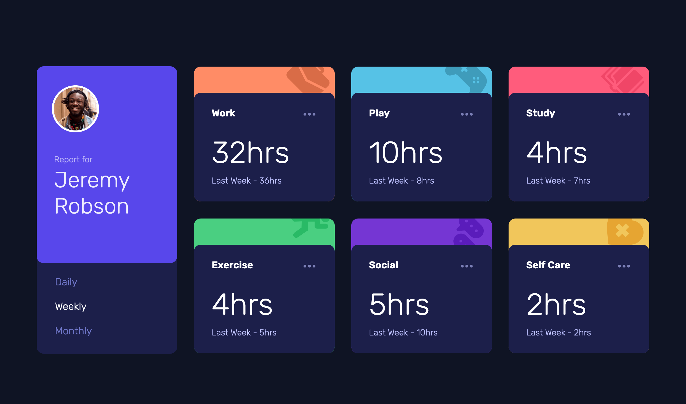

# Frontend Mentor - Time tracking dashboard solution

This is a solution to the [Time tracking dashboard challenge on Frontend Mentor](https://www.frontendmentor.io/challenges/time-tracking-dashboard-UIQ7167Jw). Frontend Mentor challenges help you improve your coding skills by building realistic projects. 

## Table of contents

- [Overview](#overview)
  - [The challenge](#the-challenge)
  - [Screenshot](#screenshot)
  - [Links](#links)
- [My process](#my-process)
  - [Built with](#built-with)
  - [What I learned](#what-i-learned)
  - [Continued development](#continued-development)
  - [Useful resources](#useful-resources)

## Overview

---

### The challenge

Users should be able to:

- View the optimal layout for the site depending on their device's screen size
- See hover states for all interactive elements on the page
- Switch between viewing Daily, Weekly, and Monthly stats

### Screenshot

### Links

- Live Site URL: [Add live site URL here](https://your-live-site-url.com)

## My process

---

### Built with

- Semantic HTML5 markup
- SCSS custom properties
- Flexbox
- CSS Grid
- Mobile-first workflow
- JSON (local data.json file)
- Sass
- TypeScript
- Webpack

### What I learned

1. TypeScript
    - typing function parameters and return value
    - interface
2. SCSS
    - variables
    - nesting
    - partials
    - modules
    - @use & @import
3. Webpack
    - basic configuration
      - entry points
      - output
      - loaders
      - plugins
      - mode
      - 3rd party plugins: nodemon

### Continued development

- This is my first attempt to try using TypeScript along with SCSS and Webpack.
For styling, as main part of this challenge, I was able to put some knowledge of CSS Grid layout into practice, though need to hone my styling and layout skills further.

### Useful resources

- [MDN Web Docs](https://developer.mozilla.org/en-US/) - This website provides comprehensive documentation for HTML, CSS, and JavaScript.
- [Sass](https://sass-lang.com/) - Sass is a stylesheet language that is compiled to CSS, a.k.a. CSS pre-processor. Sass allows you to use variables, nested rules, mixins, functions, and more features, all with a fully CSS-compatible syntax.
- [TypeScript](https://www.typescriptlang.org/) - TypeScript is a strongly typed programming language that build on JavaScript.
- [Webpack](https://webpack.js.org/) - Webpack is a *static module bundler* for modern JavaScript applications.
